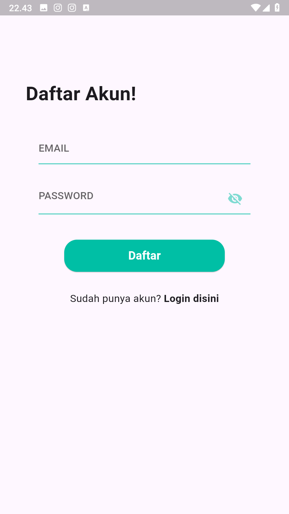

# Aplikasi-Catatan

Aplikasi ini adalah aplikasi catatan yang dikembangkan oleh Kelompok 2 dari project sebelumnya yang sudah ada. Aplikasi ini memungkinkan pengguna untuk membuat, mengedit, dan menghapus catatan mereka. Aplikasi ini dibangun menggunakan Flutter dan Firebase untuk autentikasi dan penyimpanan data.

## Copyright
Terimakasih atas referensi kode dari https://github.com/tentamdin/flutter-note

## Fitur
- Autentikasi pengguna menggunakan Firebase
- Membuat catatan baru
- Mengedit catatan yang sudah ada
- Menghapus catatan
- Menampilkan daftar catatan
- Lupa Password
- Ganti Password

## Teknologi yang Digunakan
- Flutter
- Firebase Authentication
- Firebase Firestore

## Cara Menggunakan
1. Clone repositori ini.
```
git clone https://github.com/username/Aplikasi-Catatan.git
```
3. Masuk ke direktori proyek.
```
cd Aplikasi-Catatan
```
3. Instal dependensi.
```
flutter pub get
```
4. Jalankan aplikasi.
```bash
flutter run
```
5. Atau unduh pada halaman Releases

## Screenshot Aplikasi
<div style="display: flex; justify-content: center;">
    
    
    
    
    
    
    
    
</div>


## Kelompok 2
- Yusup Muhamad (2106044)
- Muhamad Farhan Maulana (2106059)
- Reza Ruswanda (2106101)
